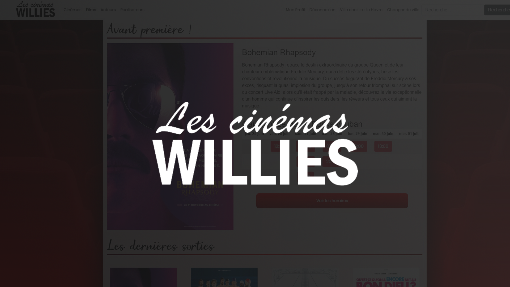
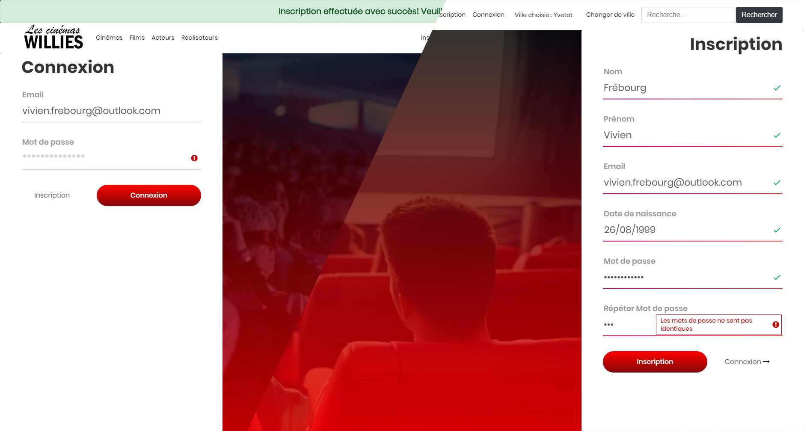
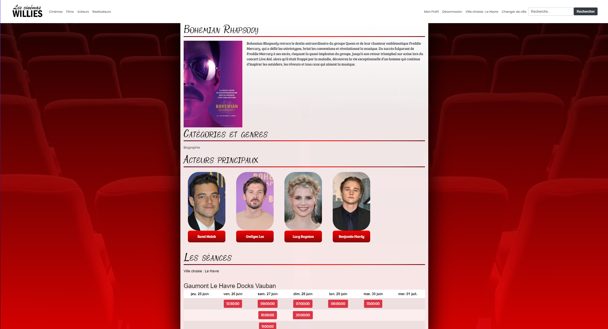
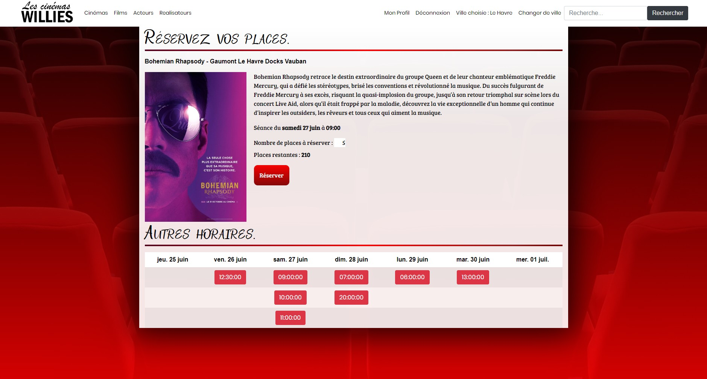
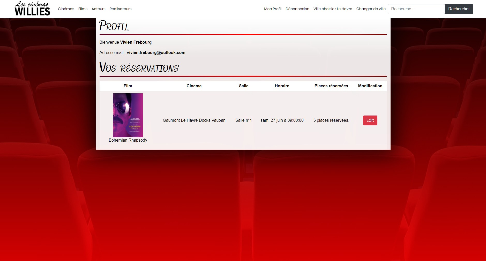
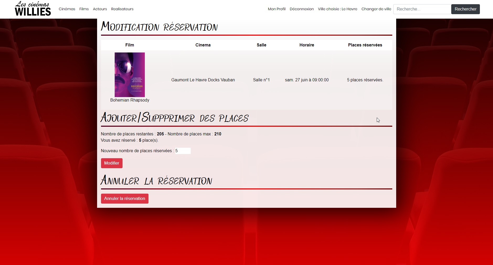

-----

Dans le cadre de mon BTS, nous devions produire un site en choisissant nous même le thème.  
Aimant le cinéma, j'ai choisi de développer un site autour de ce thème.  
Le site permet donc d'avoir les informations sur les films à l'affiche, le lieu où ils sont diffusés et les horaires.  
Il est également possible de s'inscrire et de posséder son espace client pour réserver ses places pour des films.

## Résultat
### Inscription et connexion

---
### Page d'information d'un film

---
### Réservation d'une séance

---
### Liste des réservations sur le profil

---
### Modification d'une réservation

## License
[MIT](https://choosealicense.com/licenses/mit/)

